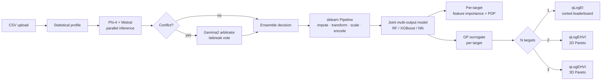

# llm-eda-mobo

**Local-LLM-driven exploratory data analysis and multi-objective Bayesian Optimization.** Two local language models (Phi-4 + Mistral) read your dataset's statistical profile, debate the preprocessing choices, and emit a fully inspectable scikit-learn `Pipeline`. From there: cross-validated joint models for up to 3 targets, partial-dependence diagnostics, and Bayesian Optimization (single-target BO or multi-target MOBO with a 3D Pareto front).

No data leaves your machine — all inference runs against a local [Ollama](https://ollama.com/) server.

---

## Why this isn't another Streamlit AutoML

| Most AutoML tools | llm-eda-mobo |
|---|---|
| Picks preprocessing from a fixed recipe | Two LLMs **decide** imputation / scaler / encoding / outlier method per dataset, with a written-out justification |
| Single model, single objective | Joint multi-output model + Bayesian Optimization across up to 3 objectives |
| Cloud API or opaque black box | Local Ollama, inspectable sklearn pipeline, decisions logged with model-by-model reasoning |
| 2D scatter only | 1D leaderboard, 2D Pareto, or **3D Pareto** depending on target count |

The LLM call is not the model. The LLM picks the *preprocessing recipe* for a standard sklearn pipeline. The pipeline does the work, and you can read it.

---

## 30-second try-it

```bash
# 1. Install — pick one
pip install .                     # core only (no BO/MOBO tab)
pip install .[bo]                 # + Bayesian Optimization / MOBO (heavy: ~3 GB torch + gpytorch + botorch)
pip install .[all]                # everything: bo + profiling + hpo + feedback
# or, full GPU-ready conda environment (env name: auto_eda, matches environment.yml):
# conda env create -f environment.yml && conda activate auto_eda

# 2. Pull the LLMs (one-time, ~10 GB)
ollama pull phi4
ollama pull mistral

# 3. Run
streamlit run app.py
```

Then in the browser at `http://localhost:8501`:

1. **Sidebar** → uncheck *Use Demo Dataset* → upload `data/slump_test.csv`.
2. **Sidebar** → Target Column(s): `slump, flow, compressive_strength`.
3. **LLM Decisions** tab → *Run Local LLM Ensemble Analysis*.
4. **Multitask Learning** tab → *Run Multitask Learning*.
5. **BO / MOBO** tab → set all three to *maximize* → *Run*. A rotate-able 3D Pareto front renders with the BO-suggested candidates overlaid.

Total time: ~30 seconds on an RTX 4090, ~2 minutes on CPU.

---

## Benchmarks

LLM-picked preprocessing → joint multi-output model, on standard tabular datasets:

| Dataset | n | Task | Best base | Score |
|---|---|---|---|---|
| Fish | 159 | regression (Weight) | RF | **R² 0.971** (LOO) |
| ENB2012 | 768 | 2-target regression (Y1, Y2) | XGBoost | **R² 0.999 / 0.991** (5-fold) |
| AmesHousing | 2930 | regression (SalePrice) | XGBoost | **R² 0.904** (5-fold) |
| Titanic | 891 | classification (Survived) | NN | **Acc 0.826** (5-fold) |
| slump_test | 103 | 3-target regression | RF | **R² 0.29 / 0.41 / 0.82** (LOO) |

LOO for `n ≤ 200`, 5-fold CV otherwise. Reproduce with `python scripts/run_benchmarks.py` (needs Ollama with `phi4` + `mistral` pulled). Per-estimator breakdown, MAE / F1, and methodology in [BENCHMARKS.md](BENCHMARKS.md).

---

## Pipeline



ASCII fallback:

```
CSV ─▶ profile ─▶ [Phi-4 ‖ Mistral] ─▶ agree? ─yes─▶ ensemble decision ─▶ sklearn Pipeline
                                          │                  ▲                    │
                                          no                 │                    │
                                          ▼                  │                    │
                                   Gemma2 tiebreaker ────────┘                    │
                                                                                  │
                          ┌───────────────────────────────────────────────────────┘
                          ▼
              joint multi-output model (RF / XGB / NN)
                          │
              ┌───────────┴───────────┐
              ▼                       ▼
       FI + PDP per target     GP surrogate per target
                                      │
                          ┌───────────┼───────────┐
                          ▼           ▼           ▼
                   1 target    2 targets    3 targets
                   leaderboard   2D Pareto   3D Pareto
                   (qLogEI)     (qLogEHVI)  (qLogEHVI)
```

---

## Tabs

| # | Tab | What it does |
|---|---|---|
| 1 | Overview | shape, dtypes, head/tail, descriptive stats |
| 2 | Missing Values | per-column NaN rate + heatmap |
| 3 | Distributions | histograms, KDE, boxplots per feature |
| 4 | Outliers | IQR / Z-score / Isolation Forest, side by side |
| 5 | Correlations | Pearson / Spearman heatmap with selectable threshold |
| 6 | **LLM Decisions** | Phi-4 + Mistral pick imputation, scaler, encoding, outlier method, correlation threshold; Gemma2 casts a low-temperature tiebreaker vote when they disagree. Per-model reasoning shown; conflicts listed. |
| 7 | Transformed Data | inspect the sklearn-pipeline output column-by-column |
| 8 | LOO Results | leave-one-out CV against the primary target |
| 9 | **Multitask Learning** | one joint MultiOutputRegressor over up to 3 targets, K-fold CV with per-target metrics |
| 10 | Feedback Loop | SHAP-driven feature engineering suggestions back to the LLM |
| 11 | Results | per-target permutation importance + top-5 partial dependence plots |
| 12 | **BO / MOBO** | GP surrogates + BoTorch acquisition. 1D leaderboard / 2D / 3D Pareto plot. BO candidates overlaid on the existing-data front. |

The three bolded tabs are the headline features. The rest are inspection surfaces — read-only views into the pipeline state.

> **Feedback Loop** is a placeholder in the UI today — its results panel reads from session state that the CLI runner populates. To exercise the SHAP-driven feedback chain (Phi-4 + Mistral debate about which features to engineer next), run it from the command line:
>
> ```bash
> python run_feedback.py              # rule-based mode
> python run_feedback.py --llm        # full LLM debate mode
> python run_feedback.py --llm --csv data/your.csv
> ```
>
> Wiring the CLI chain into the Streamlit tab is on the roadmap.

---

## Requirements

- Python 3.11+
- [Ollama](https://ollama.com/) running locally on `http://localhost:11434`
- Models: `phi4`, `mistral`, `gemma2` (`ollama pull phi4 mistral gemma2`). Gemma2 is only invoked when Phi-4 and Mistral disagree, so it's recommended but not strictly required — without it, the ensemble falls back to Phi-4's vote on conflicts.
- ~16 GB RAM minimum, 24 GB+ recommended (Phi-4 alone is ~9 GB).
- GPU optional but strongly recommended (CUDA 12+). The `RTX4090_CONFIG` in `pipeline/local_llm_engine.py` is tuned for a 24 GB card; smaller cards should drop `num_ctx` and `num_predict`.

See `requirements.txt` for the full Python dependency list.

---

## Project layout

```
llm-eda-mobo/
├── app.py                     # Streamlit entry point: page config + sidebar + tab dispatch
├── tabs/                      # one module per Streamlit tab (1 render() each)
│   ├── overview.py            # Tab 1
│   ├── missing_values.py      # Tab 2
│   ├── distributions.py       # Tab 3
│   ├── outliers.py            # Tab 4
│   ├── correlations.py        # Tab 5
│   ├── llm_decisions.py       # Tab 6 — Phi-4 + Mistral ensemble
│   ├── transformed_data.py    # Tab 7
│   ├── loo_results.py         # Tab 8
│   ├── mtl.py                 # Tab 9 — joint multi-output model
│   ├── feedback_loop.py       # Tab 10
│   ├── results.py             # Tab 11 — per-target FI + PDP
│   ├── bo_mobo.py             # Tab 12 — BO / MOBO on GP surrogates
│   ├── _shared.py             # plot theme, parity plot, stale-pipeline guard
│   └── _loo_utils.py          # LOO-specific helpers
├── eda_pipeline.py            # standalone EDA pipeline (used outside the UI)
├── pipeline/
│   ├── orchestrator.py        # AutoEDAPipeline — programmatic entry point
│   ├── local_llm_engine.py    # Phi-4 + Mistral ensemble + arbitrator
│   ├── transformers.py        # HighCorrelationRemover
│   ├── models/                # XGBoost / NN baseline models
│   ├── feedback_loop.py       # SHAP-driven feedback to the LLMs
│   └── ...
├── active_debate.py           # multi-LLM debate (used by feedback_loop)
├── arbitrator.py              # conflict resolution
├── data/                      # demo CSVs (slump_test, ENB2012, Fish, …)
└── environment.yml            # conda env spec
```

Each tab module exposes a single `render(...)` function called from `app.py`. To add a new tab, drop a `tabs/<name>.py` with a `render(...)`, add it to the `from tabs import ...` block in `app.py`, and append it to the `st.tabs([...])` list + a `with panels[N]: <name>.render(...)` dispatch.

The Streamlit app is the primary entry point. For programmatic use, skip the UI entirely:

```python
from pipeline.orchestrator import AutoEDAPipeline

eda = AutoEDAPipeline(target_col="compressive_strength", task="regression")
eda.build_pipeline(df.drop(columns=["compressive_strength"]))   # features only
transformed = eda.get_transformed_df(df.drop(columns=["compressive_strength"]))
```

Note: `AutoEDAPipeline` is single-target. For multi-target work (joint model, MOBO), strip *all* target columns from the input to `build_pipeline` and `get_transformed_df` — passing the full frame would silently transform the secondary targets into `num__<name>` feature columns. The Streamlit UI handles this stripping internally.

---

## License

MIT — see [`LICENSE`](LICENSE).
